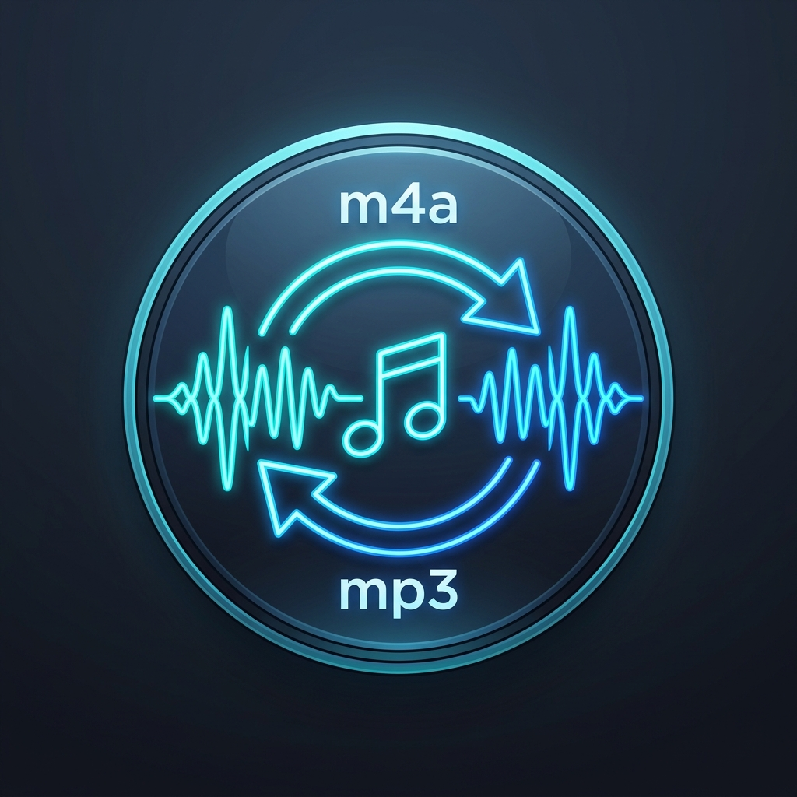

<p align="center">
  
</p>

# ♫ Audio Converter m4a to mp3 🎧

[](LICENSE)
[](VERSION)
[-purple.svg)]()
[](https://www.python.org/)

**Creator:** Alexandros - Ermis Tsourapas (SV1RVP)  
**License:** GNU Affero General Public License v3.0 (AGPL-3.0)

[🇺🇸 English](#-english) • [🇬🇷 Ελληνικά](#-ελληνικά)

---

# 🇬🇧 English

Native Windows GUI application for batch converting M4A audio files to MP3 or WAV. Conversions run multi-threaded in the background using FFmpeg, keeping the user interface fluid, responsive, and stutter-free.

---

## 🌟 Features

- **Batch Conversion**: Select and convert multiple M4A files to MP3 or WAV in a single operation.
- **Drag & Drop**: Direct drag & drop support for files and folders onto the application window (`tkinterdnd2`).
- **Conversion Queue**: Detailed table showing file name, duration, size, status, and real-time progress per item.
- **Queue Management**: Remove selected files or clear the entire queue with ease.
- **MP3 Quality Selection**: Choose bitrates from 128, 192, 256, or 320 kbps (CBR / LAME).
- **Portable FFmpeg**: Completely standalone operation without requiring manual Windows `PATH` configuration.
- **Data Protection**: Confirmation dialog prior to overwriting existing files.
- **Modern UI**: Clean, responsive layout with **Light** and **Dark** theme support.
- **Real-Time Progress**: Live conversion percentage with instant queue cancellation.
- **Custom Output Folder**: Specify a custom destination folder or save next to each source file, with a one-click button to open the folder in Explorer.
- **Bilingual Interface**: Full English (default) and Greek localization, switchable on the fly (`🇬🇧 EN` / `🇬🇷 EL`) without restarting.
- **Preference Persistence**: Automatically preserves user settings (language, bitrate, theme, output folder).
- **GitHub Auto-Updater**: One-click update checking directly from the header or Help menu with release notes and automatic installation.
- **Automated Installer**: Automated script for Python 3.12, local `.venv` setup, and FFmpeg download with SHA-256 checksum verification.

---

## 💻 System Requirements

- **Windows 10** or **Windows 11** (64-bit).
- **PowerShell 5.1** or newer.
- Active Internet connection during initial setup (to download dependencies and FFmpeg).
- `winget` is automatically used only if Python 3.12 is not already detected.

> [!NOTE]
> The portable FFmpeg builds downloaded by the installer require Windows 10 or later.

---

## 🚀 Getting Started (Installation)

1. Clone or download the repository:
   ```bash
   git clone https://github.com/SV1RVP/Audio-Converter-m4a-to-mp3.git
   cd "Audio Converter m4a to mp3"
   ```
2. Double-click **`install.bat`**.
3. Wait for the `.venv` setup and required downloads to complete.

The installer automatically handles:
1. Downloading the official FFmpeg essentials build (with retry logic and GitHub mirror fallback).
2. Mandatory integrity verification via **SHA-256 hash** before extraction.
3. Detecting or installing Python 3.12.
4. Setting up the isolated local `.venv` environment.
5. Installing `tkinterdnd2` for native drag & drop.

---

## ⚡ Launching the Application

Double-click **`run.bat`**. The application starts independently using the isolated `.venv` Python environment. If the virtual environment does not exist yet, the installation runs automatically.

---

## 🔄 Automatic Updates

The application includes a zero-dependency GitHub update mechanism:
- **Header Button («🔄 Check»)**: Checks for newer releases in the repository.
- **Update Notification**: When an update is detected, the button displays `⚡ vX.X.X` and opens a release notes dialog.
- **One-Click Update**: Clicking «⚡ Update Now» downloads the update archive, updates code files in-place, and restarts the app while preserving your FFmpeg binaries and saved settings.

---

## 🌐 Languages

The app natively supports:
- **English** (Default)
- **Ελληνικά** (Greek)

Switch languages anytime:
1. Click the toggle button in the top-right header (`🇺🇸 EN` / `🇬🇷 ΕΛ`).
2. Via the menu bar: **Language** -> select **EN (🇺🇸)** or **ΕΛ (🇬🇷)**.

All UI components (buttons, labels, dialogs, queue columns, and status messages) update immediately without restarting.

---

## 📁 File Output

Converted files are saved with the same base name and `.mp3` or `.wav` extension either next to the source files or in the chosen output directory. If an identically named file already exists, a confirmation prompt asks before overwriting.

---

## ❓ Troubleshooting (FAQ)

- **PowerShell Execution Policy Error**:  
  If script execution is blocked when running `install.bat`, open PowerShell as Administrator and run:
  ```powershell
  Set-ExecutionPolicy RemoteSigned -Scope CurrentUser
  ```
- **Manual FFmpeg Setup**:  
  If your network restricts downloads, place `ffmpeg.exe` and `ffprobe.exe` directly into the root application directory.

---

## ⚖️ Licensing

- Application source code is licensed under **GNU Affero General Public License v3.0 only**. See [LICENSE](LICENSE).
- FFmpeg is third-party software under GPLv3 / LGPL. Binaries are not stored in this repository. See [THIRD_PARTY_NOTICES.md](THIRD_PARTY_NOTICES.md) and [FFMPEG_LICENSE.txt](FFMPEG_LICENSE.txt).

---

## 🤝 Security & Contributions

- To report vulnerabilities, review [SECURITY.md](SECURITY.md).
- To contribute code, review [CONTRIBUTING.md](CONTRIBUTING.md).
- Detailed version changes are tracked in [CHANGELOG.md](CHANGELOG.md).

---

# 🇬🇷 Ελληνικά

Γραφική εφαρμογή Windows (Native GUI) για μαζική μετατροπή αρχείων M4A σε MP3 ή WAV. Η μετατροπή εκτελείται στο παρασκήνιο (multi-threaded) με το FFmpeg, ώστε το περιβάλλον να παραμένει άμεσο και πλήρως λειτουργικό.

---

## 🌟 Δυνατότητες

- **Μαζική μετατροπή**: Επιλογή και μετατροπή πολλαπλών αρχείων M4A σε MP3 ή WAV.
- **Drag & Drop**: Άμεση μεταφορά αρχείων ή ολόκληρων φακέλων στο παράθυρο της εφαρμογής (`tkinterdnd2`).
- **Πίνακας ουράς μετατροπών**: Λεπτομερής λίστα με όνομα, διάρκεια, μέγεθος, κατάσταση και ποσοστό προόδου ανά αρχείο.
- **Διαχείριση λίστας**: Αφαίρεση επιλεγμένων αρχείων και πλήρης καθαρισμός ουράς.
- **Επιλογές ποιότητας MP3**: Ρύθμιση bitrate σε 128, 192, 256 ή 320 kbps (CBR / LAME).
- **Portable FFmpeg**: Αυτόνομη λειτουργία χωρίς απαίτηση χειροκίνητης παραμετροποίησης του Windows `PATH`.
- **Ασφάλεια δεδομένων**: Προειδοποίηση επιβεβαίωσης πριν από αντικατάσταση υπάρχοντος αρχείου.
- **Σύγχρονο UI**: Responsive σχεδιασμός με επιλογή **Φωτεινού (Light)** και **Σκούρου (Dark)** θέματος.
- **Πραγματική ένδειξη προόδου**: Παρακολούθηση σε πραγματικό χρόνο και δυνατότητα άμεσης ακύρωσης.
- **Επιλογή φακέλου εξόδου**: Προσαρμοσμένος φάκελος προορισμού ή αυτόματη αποθήκευση δίπλα στο αρχικό αρχείο, με κουμπί άμεσου ανοίγματος του φακέλου.
- **Πολυγλωσσικό περιβάλλον (Multilingual)**: Πλήρης υποστήριξη Αγγλικών (English - προεπιλογή) και Ελληνικών (Ελληνικά). Δυνατότητα άμεσης αλλαγής γλώσσας με ένα κλικ από το κουμπί της κεφαλίδας (`🇬🇧 EN` / `🇬🇷 EL`) ή από τη γραμμή μενού, χωρίς ανάγκη επανεκκίνησης της εφαρμογής.
- **Αποθήκευση προτιμήσεων**: Αυτόματη διατήρηση των τελευταίων ρυθμίσεων του χρήστη (γλώσσα, bitrate, θέμα, φάκελος εξόδου).
- **Έλεγχος & Αυτόματη Ενημέρωση (GitHub Auto-Updater)**: Έλεγχος νέων εκδόσεων με 1 κλικ απευθείας από την κεφαλίδα ή το μενού «Βοήθεια», με προβολή changelog και αυτόματη λήψη & επανεκκίνηση.
- **Αυτοματοποιημένος Installer**: Αυτόματη εγκατάσταση Python 3.12, ρύθμιση `.venv` και λήψη FFmpeg με επαλήθευση SHA-256.

---

## 💻 Υποστηριζόμενο Λειτουργικό Σύστημα

- **Windows 10** ή **Windows 11** (64-bit).
- **PowerShell 5.1** ή νεότερο.
- Σύνδεση στο Internet κατά την πρώτη εγκατάσταση (για λήψη βιβλιοθηκών και FFmpeg).
- Το εργαλείο `winget` χρησιμοποιείται αυτόματα μόνο εάν δεν υπάρχει ήδη εγκατεστημένη η Python 3.12.

> [!NOTE]
> Τα portable FFmpeg builds που κατεβάζει ο installer απαιτούν Windows 10 ή νεότερο.

---

## 🚀 Πρώτη Εγκατάσταση

1. Κατέβασε ή κάνε clone το repository:
   ```bash
   git clone https://github.com/SV1RVP/Audio-Converter-m4a-to-mp3.git
   cd "Audio Converter m4a to mp3"
   ```
2. Κάνε διπλό κλικ στο **`install.bat`**.
3. Περίμενε να ολοκληρωθεί η ρύθμιση του `.venv` και οι απαραίτητες λήψεις.

Ο installer αναλαμβάνει αυτόματα:
1. Τη λήψη του FFmpeg essentials build (με επαναλήψεις και GitHub mirror fallback).
2. Την υποχρεωτική επαλήθευση ακεραιότητας μέσω **SHA-256 hash** πριν από την αποσυμπίεση.
3. Την ανίχνευση ή αυτόματη εγκατάσταση της Python 3.12.
4. Τη δημιουργία του τοπικού περιβάλλοντος `.venv`.
5. Την εγκατάσταση του `tkinterdnd2` για native drag & drop.

---

## ⚡ Εκκίνηση

Κάνε διπλό κλικ στο **`run.bat`**. Η εφαρμογή ξεκινά αυτόνομα με την Python του απομονωμένου `.venv`. Αν το `.venv` δεν υπάρχει, εκτελείται αυτόματα η εγκατάσταση.

---

## 🔄 Αυτόματη Ενημέρωση (Updates)

Η εφαρμογή διαθέτει ενσωματωμένο μηχανισμό ελέγχου ενημερώσεων από το GitHub:
- **Κουμπί «🔄 Έλεγχος» στην κεφαλίδα**: Ελέγχει αν υπάρχει νεότερη έκδοση στο αποθετήριο.
- **Αυτόματη ειδοποίηση**: Εάν υπάρχει νέα έκδοση, το κουμπί εμφανίζει την ένδειξη `⚡ vX.X.X` και ανοίγει παράθυρο με τις σημειώσεις έκδοσης (Changelog).
- **Αυτόματη εφαρμογή (1 Κλικ)**: Με το πάτημα του κουμπιού «⚡ Ενημέρωση Τώρα», γίνεται λήψη του πακέτου, ενημέρωση των αρχείων κώδικα και αυτόματη επανεκκίνηση, διατηρώντας ανέπαφα τα αρχεία FFmpeg και τις ρυθμίσεις σας.

---

## 🌐 Γλώσσες (Languages)

Η εφαρμογή υποστηρίζει πλήρως δύο γλώσσες:
- **English** (Προεπιλογή / Default)
- **Ελληνικά** (Greek)

Μπορείτε να αλλάξετε γλώσσα άμεσα με δύο τρόπους:
1. Κάνοντας κλικ στο κουμπί εναλλαγής στην πάνω δεξιά γωνία (`🇺🇸 EN` / `🇬🇷 ΕΛ`).
2. Από το κεντρικό μενού: **Language** / **Γλώσσα** -> **EN (🇺🇸)** ή **ΕΛ (🇬🇷)**.

Όλα τα στοιχεία του περιβάλλοντος (κουμπιά, ετικέτες, διάλογοι, μηνύματα ειδοποίησης και καταστάσεις αρχείων) μεταφράζονται δυναμικά χωρίς να απαιτείται επανεκκίνηση, και η προτίμηση αποθηκεύεται αυτόματα.

---

## 📁 Αποθήκευση Αρχείων

Το μετατραπέν αρχείο αποθηκεύεται δίπλα στο αρχικό M4A με το ίδιο όνομα και κατάληξη `.mp3` ή `.wav`, εκτός εάν έχει οριστεί συγκεκριμένος φάκελος εξόδου. Σε περίπτωση συνωνυμίας, η εφαρμογή ζητά επιβεβαίωση πριν από την αντικατάσταση.

---

## ❓ Αντιμετώπιση Προβλημάτων (FAQ)

- **Σφάλμα PowerShell Execution Policy**:  
  Εάν εμφανιστεί σφάλμα εκτέλεσης script κατά το τρέξιμο του `install.bat`, ανοίξτε το PowerShell ως διαχειριστής και εκτελέστε:
  ```powershell
  Set-ExecutionPolicy RemoteSigned -Scope CurrentUser
  ```
- **Χειροκίνητη προσθήκη FFmpeg**:  
  Εάν το δίκτυό σας μπλοκάρει τη λήψη, μπορείτε να τοποθετήσετε απευθείας τα εκτελέσιμα `ffmpeg.exe` και `ffprobe.exe` στον κύριο φάκελο της εφαρμογής.

---

## ⚖️ Άδειες Χρήσης

- Ο κώδικας αυτού του project διατίθεται υπό την άδεια **GNU Affero General Public License v3.0 only**. Δείτε το αρχείο [LICENSE](LICENSE).
- Το FFmpeg αποτελεί έργο τρίτων και διατηρεί τη δική του άδεια (GPLv3 / LGPL). Τα εκτελέσιμα FFmpeg δεν αποθηκεύονται στο αποθετήριο. Δείτε τα [THIRD_PARTY_NOTICES.md](THIRD_PARTY_NOTICES.md) και [FFMPEG_LICENSE.txt](FFMPEG_LICENSE.txt).

---

## 🤝 Ασφάλεια και Συνεισφορές

- Για αναφορά ευπάθειας, διαβάστε το [SECURITY.md](SECURITY.md).
- Για συνεισφορά κώδικα, διαβάστε το [CONTRIBUTING.md](CONTRIBUTING.md).
- Οι αλλαγές ανά έκδοση καταγράφονται στο [CHANGELOG.md](CHANGELOG.md).
